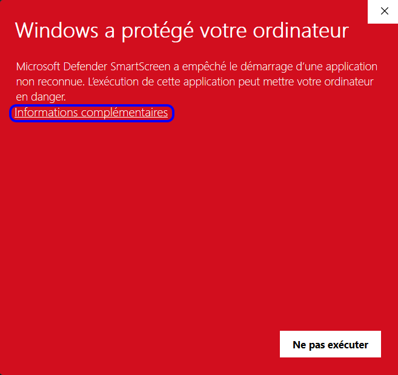
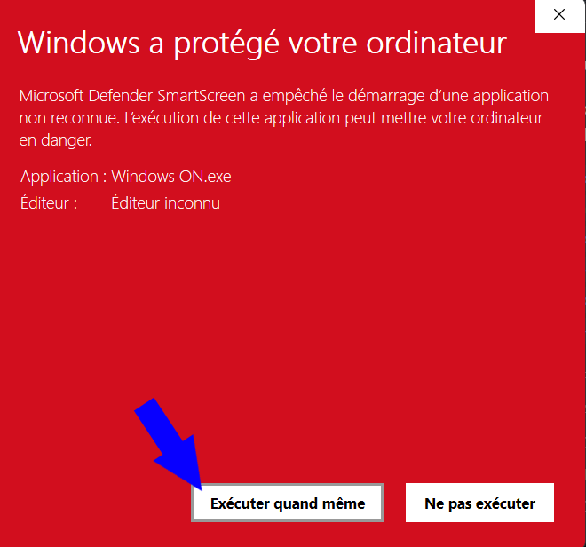
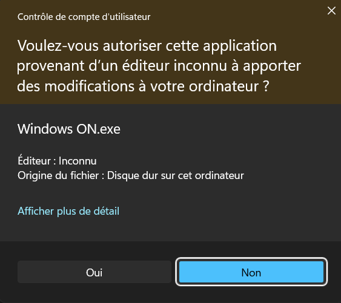

<h1 align="center">
 

 
Windows ON
 
</h1>

# Description du script
Ce script à été créer en batch pour activer windows 10 ou 11 de manière gratuite

# Fonctions
- Activer Windows 10/11
- Activation à l'aide d'une clé windows
- Désinstallation de la licence windows
- Vérifier l'état d'activation windows

# Première exécution
Lors de la 1re exécution Windows va essayer de vous protéger en affichant une fenêtre de la couleur accentuation de votre système (dans mon cas rouge) mais si vous n'avez pas changé, elle sera en bleu.
Quand cela arrive pas d'inquiétude vous n'avez pas été piratez ou autres, c'est tout à fait normal. Et si vous en doutez le code source est présent dans le fichier zip, le fichier .exe ainsi que le script ont été analyser par virus Total donc pas d'inquiétude.
La raison est due au fait que l'éditeur est "inconnu" 
Pour exécuter il faudra appuyer sur "information complémentaire"

Par la suite il faut appuyer sur "Exécuter quand même"

Et il faudra juste par la suite appuyer sur oui sur la fenêtre qui demande si on accepte que l'application apporte des modification sur l'ordinateur.

À présicer que cette apparaitra chaque fois que vous exécutez cette exécutable lors des prochaine fois.
